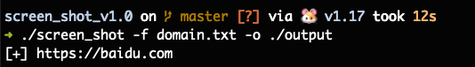
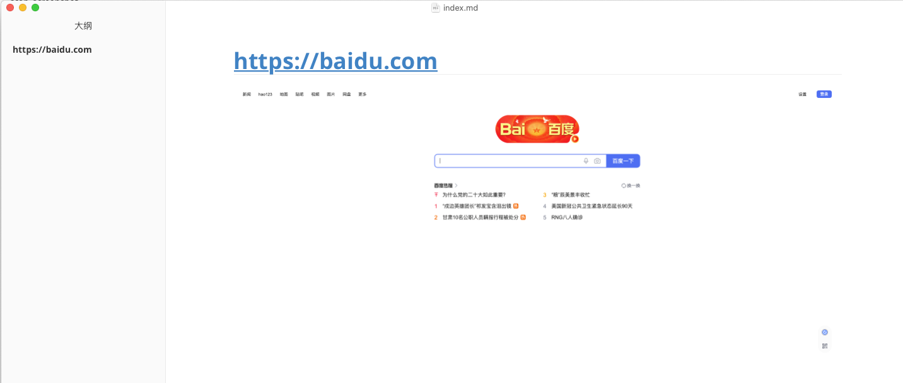
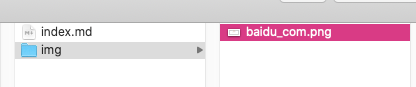

# scan_screenshot
golang写的批量对目标网站进行截图的小工具，适合目标资产比较多时，快速定位薄弱点。


# 使用方法

```
➜ ./screen_shot -h
Usage of ./screen_shot:
  -f string
    	目标存放文件 (default "domain.txt")
  -o string
    	输出的文件夹 (default "./output")
```






